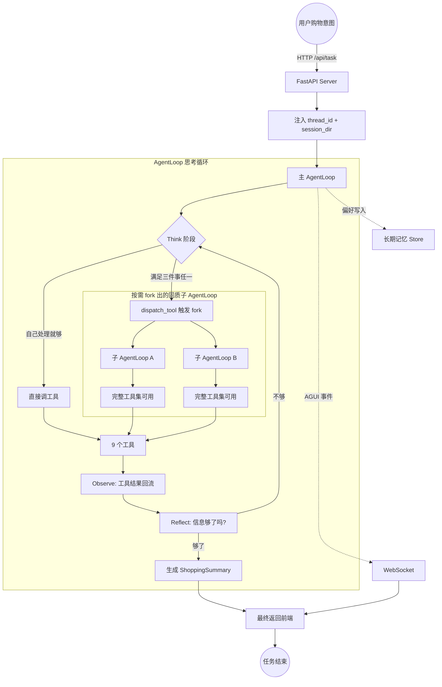

# OmniMatch 项目构想

## 0. 文档用途

本文档用于向 AI 或开发者说明 OmniMatch 的项目目标、产品形态、Agent 架构、核心工具、基础设施和目录结构。

AI 读取本文档时，应重点理解：

- OmniMatch 是一个对话式跨平台购物 Agent。
- 核心工程目标不是简单接入搜索 API，而是构建可并行、可记忆、可观测、可评测、可训练的 Agent 主链路。
- 架构范式是 `主 AgentLoop + 按需 fork 同质子 AgentLoop + 9 个核心工具 + 5 类基础设施`。

## 1. 项目重点

很多教程会说“接一个搜索 API 就能做 Agent”。这当然能跑，但离真实场景下可用的购物 Agent 还差很远。

在电商搜索里，重点不是让模型说得更顺，而是解决以下工程问题：

- 一个购物意图什么时候该并行搜多个平台，什么时候主 loop 自己处理就够了。
- 10 轮对话之后 token 怎么不爆掉，缓存命中率怎么不掉。
- 后端运行十几秒的长任务，前端怎么不傻等，怎么实时看到 Agent 正在干什么。
- 用户上一轮说“不要塑料的”，下一轮怎么让 Agent 还记得。
- 每天大量 bad case 怎么不再只靠 prompt 修，而是靠评测和训练把模型行为真正对齐。
- 闭源大模型一升级线上就抖动，怎么把模型行为变得可控、可迭代。

因此，这套项目更像一条工程进阶线：从 AgentLoop 的基本概念开始，逐步把 fork 策略、向量召回、上下文压缩、长期记忆、事件协议、评测训练串起来，最后落到一个真正能跨平台搜索、能持续优化的购物 Agent。

学完之后，应该能说清楚三件事：

1. AgentLoop 这种范式比传统 Workflow 强在哪，什么场景下值得用。
2. 多 Agent、向量召回、长期记忆、评测训练这些能力分别解决真实 Agent 项目里的哪块痛点。
3. 一个对话式购物 Agent 从用户输入到商品交付，中间经过哪些层，每一层为什么必须存在。

## 2. 最终产品形态

从用户视角看，OmniMatch 是一个“会替你买东西的对话助手”。

用户可以提出这样的任务：

> 我想买一套便宜又抗造的旅行三件套，预算 300 块，最好不要塑料的，喜欢小众一点。

系统背后会按需执行：

1. `Planner` 拆解需求：预算 300、材质偏好（不要塑料）、风格偏好（小众）、品类（旅行三件套）。
2. `CategoryInsight` 调爆款数据，判断“旅行三件套”在不同人群里通常搭什么。
3. `ItemSearch` 触发跨平台并行 fork，亚马逊 / Shopee / 速卖通 / eBay 同时搜索。
4. 每个平台的子 Agent 独立运行 `ItemSearch + ShippingCalc`，估算关税和运费。
5. 主 loop 合流后用 `PriceCompare` 计算“加上运费谁最划算”。
6. `ItemPicker` 按用户偏好（不要塑料、小众）做二次精挑。
7. `ShoppingSummary` 输出带购买理由的商品清单。
8. 同时把“不要塑料”“偏好小众”等长期偏好写入 `Store`，下次自动生效。

执行过程中，前端不是简单显示“等待中”，而是通过 `AGUI` 事件协议和 `WebSocket` 实时显示每一步：

```text
Planner 正在拆解需求...
ItemSearch 正在跨 4 个平台并行检索...
PriceCompare 正在比价...
ItemPicker 已为你过滤掉 12 件塑料制品...
ShoppingSummary 生成中...
```

如果任务生成了文件，例如完整商品清单 PDF，页面会展示输出文件列表，用户可以直接下载。

## 3. 当前版本范围

当前版本重点覆盖 Agent 主链路：

```text
对话式购物意图理解
  -> 多 Agent 并行 / 串行调度
  -> 跨平台商品检索 + 比价 + 关税运费
  -> 三塔向量召回（语义 + 个性化）
  -> 长期记忆与偏好持久化
  -> AGUI 实时事件回传
  -> 评测 + 训练数据飞轮
```

第一版不展开以下电商业务级能力：

- 真实电商平台账号授权 / OAuth 接入。
- 商品下单 / 支付 / 物流追踪闭环。
- 多语言货币的精细汇率换算与对账。
- 商品图片视觉理解 / 多模态检索。
- 反爬虫 / IP 代理池 / 风控对抗。
- 商品库存实时同步与缓存一致性。
- 用户隐私合规（GDPR / CCPA）。
- 大规模 RL 训练所需的分布式集群与 reward model 服务。

这些能力都重要，但不适合一开始全部放进来。第一版先把 Agent 主链路和工程基础设施讲清楚，后续再逐层扩展。

## 4. 整体架构

### 4.1 架构一句话

OmniMatch 的核心架构可以概括为：

```text
1 个主 AgentLoop
+ N 个按需 fork 的同质子 AgentLoop
+ 9 个核心工具
+ 5 类基础设施
```

### 4.2 主 AgentLoop

OmniMatch 使用的不是预定义异构子智能体，而是 `主 AgentLoop + 按需 fork 同质子 AgentLoop` 的范式。

主 AgentLoop 像一个有完整能力的研究员，它自己能调用全部 9 个工具，包括 `ItemSearch`、`PriceCompare`、`ShoppingSummary`。

主 AgentLoop 的职责：

- 理解用户购物意图。
- 拆解成子目标，例如预算、品类、材质、风格。
- 在每一轮 Think 阶段判断：当前子目标由主 loop 处理就够了，还是应该 fork 一个同质子 Agent 并行或隔离处理。
- 收齐子 Agent 回传的结构化结果，继续下一轮决策。
- 最终输出 `ShoppingSummary`。

### 4.3 同质子 AgentLoop

子 AgentLoop 不是预先定义好的异构 worker，而是主 loop 通过 `dispatch_tool(demands)` 工具触发后 fork 出来的一份完整克隆。

子 AgentLoop 拥有：

- 同样的工具集。
- 同样的 system prompt。
- 同样的思考能力。

子 AgentLoop 和主 AgentLoop 的区别：

| 维度 | 主 AgentLoop | 同质子 AgentLoop |
| --- | --- | --- |
| `thread_id` | 用户会话的 `thread_id` | `sub-{uuid8}`，独立线程 |
| `checkpoint` | 用户主线对话历史 | 子任务专属，不污染主 loop |
| 输入 | 用户原始 query | 主 loop 派发的 `demands` 字符串 |
| 返回值 | 直接回传给前端 | 作为 `dispatch_tool(...)` 的字符串结果返回给主 loop |

从主 loop 视角看，子 Agent 只是一次普通工具调用。这种设计让多 Agent 协同对主 loop 完全透明。

### 4.4 fork 触发条件

主 AgentLoop 在每一轮 Think 阶段，会判断当前子任务是否满足以下任一条件。满足则 fork，不满足则主 loop 自己处理。

| 条件 | 含义 | OmniMatch 典型场景 |
| --- | --- | --- |
| 能并行 | 多个子任务彼此独立，并行能直接缩短延迟 | 跨 4 个平台同时调用 `ItemSearch` |
| 上下文隔离 | 子任务上下文很大，不能污染主 loop | 一次性拉 100 件商品的完整字段做精挑 |
| 调用链 >= 3 | 子任务内部还要多轮 Think -> Act -> Observe | 品类洞察先看爆款，再看属性，再看价格区间 |

## 5. 核心工具

9 个工具按归属和触发场景拆分如下：

| 工具 | 调用者 | 作用 |
| --- | --- | --- |
| `Planner` | 主 loop | 把购物意图拆解成结构化的预算 / 品类 / 偏好 / 约束 |
| `ChatFallback` | 主 loop | 闲聊 / 不需要检索的兜底问答 |
| `WebSearch` | 主 loop / 子 Agent | 评测、热门趋势这类外部资料检索 |
| `CategoryInsight` | 主 loop 或 fork | 品类爆款、典型属性洞察，基于 RAG 商品知识库 |
| `ItemSearch` | 主 loop / 子 Agent | 单平台商品检索；跨平台时由主 loop fork 多份并行调用 |
| `ItemPicker` | 主 loop 或 fork | 在合流后的候选集里按用户偏好做二次精挑 |
| `PriceCompare` | 主 loop | 跨平台候选商品比价 |
| `ShippingCalc` | 主 loop / 子 Agent | 关税 + 运费估算 |
| `ShoppingSummary` | 主 loop | 生成最终清单 + 选购理由；终结性工具 |

注意：`dispatch_tool` 不在业务工具表里。它是触发 fork 的元工具，主 loop 调用它意味着“派一个同质子 Agent 去执行这段 demands”。

## 6. 基础设施

OmniMatch 的工程门槛集中在基础设施层。每类基础设施对应前面已经学过的一章。

| 基础设施 | 解决什么 | 对应章节 |
| --- | --- | --- |
| 三塔向量召回 | 跨语言 / 个性化召回，让 `ItemSearch` 不只是命中字面词 | 第 4-0 章 |
| 向量基础设施选型 | Faiss / OpenSearch 双栈分层选型与论证 | 第 4-1 章 |
| Cache Breakpoint | 10 轮对话后 token 不爆，缓存命中率不掉 | 第 5 章 |
| 长期记忆 Store | 用户偏好跨会话持久化 | 第 6 章 |
| AGUI 事件协议 | 长任务前端实时可见 | 第 7 章 |
| 评测训练闭环 | Rubric -> SFT -> Agentic RL，让模型行为可控 | 第 8 章 |

## 7. 思考循环

OmniMatch 主 AgentLoop 的核心循环是：

```text
Think -> Act -> Observe -> Reflect
```

该循环支持按需 fork。



这张图需要抓住三个关键点：

- FastAPI 接到任务后异步启动主 AgentLoop，立刻返回 `thread_id`，不等待结果。
- 主 loop 在 Think 阶段做“自己处理 vs fork 子 Agent”的判断，fork 对主 loop 全透明。
- 工具结果回流后进入 Reflect，可以反复 `Think -> Act -> Observe`，直到信息足够才生成 `ShoppingSummary`。

## 8. 技术栈与职责

| 层次 | 技术 | 在项目里的作用 |
| --- | --- | --- |
| Agent 范式 | AgentLoop，基于 LangChain 二次抽象 | 主 / 同质子的 `Think -> Act -> Observe -> Reflect` 循环 |
| Fork 机制 | `dispatch_tool(demands)` 元工具 | 主 loop 透明触发同质子 AgentLoop |
| 模型接入 | LangChain + `init_chat_model` | 统一封装大模型、工具声明、Runnable 兼容 |
| 向量召回层 | LLM 三塔模型 + Faiss（HNSW + IP，生产演进 Milvus） | 跨语言跨平台商品语义 + 个性化双通道召回 |
| 向量应用层 | OpenSearch（Hybrid Query + COSINE + ik） | 长期偏好、RAG 品类知识库：语义 + 全文 + 标量三路加权融合 |
| 长期记忆 | Store 接口（LangGraph BaseStore + OpenSearch 后端） | 偏好 / 黑名单 / 历史选择跨会话持久化 |
| 上下文压缩 | Cache Breakpoint + 自定义压缩策略 | 50+ 轮对话不爆 token，同时保持 Prompt Cache 命中率 |
| 事件协议 | AGUI 标准事件流 | 前端实时可见 Agent 在做什么 |
| 后端服务 | FastAPI + Uvicorn + asyncio | 长任务异步、`active_tasks` 表、取消、文件接口 |
| 实时通信 | WebSocket + ConnectionManager | 按 `thread_id` 路由事件到对应前端 |
| 前端页面 | React + Vite | 对话框、AGUI 事件可视化、商品卡片、长期偏好面板 |
| 评测体系 | Rubrics as Rewards | 每条 query 动态生成 P0/P1/P2 评分细则 |
| 模型训练 | SFT + Agentic RL（GSPO 等） | 高分轨迹 SFT 冷启动，再上 RL |
| 异步上下文 | asyncio + ContextVar | 多用户并发任务隔离，`thread_id` 跨层透明传递 |
| 路径管理 | pathlib + shutil | 解析上传 / 输出 / 会话目录路径 |
| 环境配置 | python-dotenv | 从 `.env` 读取模型 / 召回 / Store / 平台 API 配置 |
| 环境管理 | uv + Python 3.10 | 管理依赖与虚拟环境 |

当前阶段最重要的三件事：

1. AgentLoop 怎么组织，包括 fork。
2. FastAPI + WebSocket 怎么实时通信。
3. ContextVar + 会话目录怎么避免多用户任务串台。

向量库选型，包括为什么召回层用 Faiss、应用层用 OpenSearch，Pre / Post / Hybrid 三种检索模式对比，以及主流 8 家向量库的横向评估，集中在：[第 4-1 章 向量基础设施选型与 OpenSearch 演进方向](04-1%20向量基础设施选型与OpenSearch演进方向.md)。

## 9. 项目目录结构

最终项目的主要结构如下：

```text
OmniMatch/
├── app/                          # 后端业务代码主目录
│   ├── agent/                    # AgentLoop 主体与 fork 机制
│   │   ├── llm.py                # 统一创建大模型对象
│   │   ├── prompts.py            # 读取 app/prompt/prompts.yml
│   │   ├── main_agent.py         # 后续章节补充：主 AgentLoop 组装入口
│   │   ├── dispatch_tool.py      # 后续章节补充：fork 同质子 AgentLoop 的元工具
│   │   └── system_prompt.py      # 主 / 子共用的 system prompt 拼装
│   ├── api/                      # FastAPI、WebSocket、上下文与监控
│   │   ├── context.py            # 保存 thread_id + session_dir 的 ContextVar
│   │   ├── monitor.py            # 推送 AGUI 事件（tool_start / tool_end / task_result）
│   │   ├── connection.py         # ConnectionManager：thread_id -> WebSocket 路由
│   │   └── server.py             # 后续章节补充：FastAPI 服务入口
│   ├── tools/                    # 9 个核心工具实现
│   │   ├── planner.py            # 后续章节补充：意图拆解
│   │   ├── chat_fallback.py      # 兜底闲聊
│   │   ├── web_search.py         # 外部资料检索
│   │   ├── category_insight.py   # 后续章节补充：品类爆款洞察（基于 RAG 商品知识库）
│   │   ├── item_search.py        # 后续章节补充：跨平台商品检索
│   │   ├── item_picker.py        # 候选集二次精挑
│   │   ├── price_compare.py      # 后续章节补充：跨平台比价
│   │   ├── shipping_calc.py      # 后续章节补充：关税运费估算
│   │   └── shopping_summary.py   # 终结性工具：生成清单
│   ├── recall/                   # LLM 三塔向量召回客户端
│   │   ├── tower_user.py         # User 塔
│   │   ├── tower_query.py        # Query 塔
│   │   ├── tower_item.py         # Item 塔
│   │   └── ann.py                # ANN 索引访问（Faiss / Milvus）
│   ├── memory/                   # 长期记忆 Store
│   │   ├── store.py              # PreferenceEntry 读写
│   │   └── injector.py           # 注入 system prompt 末尾
│   ├── compress/                 # Cache Breakpoint 上下文压缩
│   │   ├── breakpoint.py         # 计算压缩边界
│   │   └── compressor.py         # 边界以前的消息压缩成摘要
│   ├── eval/                     # 评测与训练数据采集
│   │   ├── rubric.py             # 动态生成 Rubric
│   │   ├── judge.py              # 自动 judge 打分
│   │   └── trace_logger.py       # 高分轨迹入库
│   ├── prompt/                   # 提示词配置
│   │   └── prompts.yml           # 主 / 子共用 system prompt + 工具描述
│   └── utils/                    # 普通 Python 工具函数
│       ├── path_utils.py         # 解析上传 / 输出 / 会话目录路径
│       └── thread_ctx.py         # 设置 / 读取 ContextVar 的封装
├── frontend/                     # React + Vite 前端项目
├── docker/                       # 本地服务（向量库、Redis 等）的 Docker Compose
├── examples/                     # 第 1 到 8 章对应的能力示例脚本
├── tests/                        # 工具、连接管理、取消任务等测试
├── output/                       # 运行时生成：清单 / 报告
├── uploaded/                     # 运行时生成：用户上传文件
├── .env.example                  # 环境变量示例
├── .env                          # 本地真实配置，不提交仓库
├── .python-version
├── pyproject.toml
└── uv.lock
```
